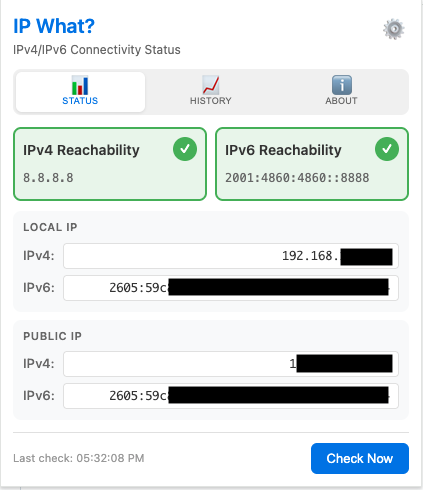
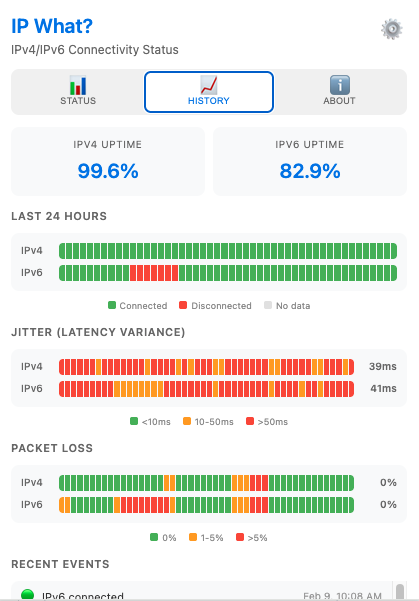
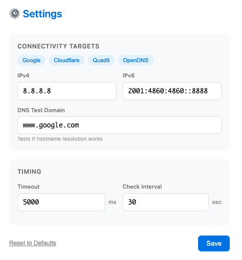

# IP What? - IPv4/IPv6 Connectivity Checker

A Chrome extension that monitors IPv4 and IPv6 connectivity in real-time.

## Features

- ✅ Real-time IPv4 and IPv6 connectivity status
- 🌐 Local and public IP address display
- 📊 Connectivity history with jitter and packet loss metrics
- 🌓 Automatic dark/light mode based on system preference
- ⚙️ Configurable ping targets (default: Google DNS)
- 🎨 Visual badge indicator for quick status checks
- ⏱️ Latency measurement with EMA-smoothed jitter
- 📋 Click-to-copy IP addresses
- 📈 Export history to CSV
- 🔧 Preset targets for popular DNS providers

## Installation

### From Chrome Web Store
*(Coming soon)*

### Manual Installation
1. Download the latest release from [GitHub Releases](https://github.com/krich11/ipwhat/releases)
2. Extract the zip file
3. Open Chrome and navigate to `chrome://extensions/`
4. Enable "Developer mode" (toggle in top-right corner)
5. Click "Load unpacked"
6. Select the extracted folder

**Quick Install Scripts:**
- **macOS/Linux:** Run `./install.sh` in the extracted folder
- **Windows:** Right-click `install.ps1` → "Run with PowerShell"

## Usage

- Click the extension icon to see current connectivity status
- Green checkmark = Both IPv4 and IPv6 connected
- Orange exclamation = Partial connectivity  
- Red X = No connectivity

### Tabs
- **Status** - Current connectivity, IP addresses, and latency
- **History** - 24-hour connectivity graph, jitter, packet loss, and event log
- **About** - Version info, links, and support

### Settings

Click the ⚙️ icon or right-click the extension icon and select "Options" to:
- Change IPv4/IPv6 target addresses
- Adjust timeout and check intervals
- Use preset configurations (Google, Cloudflare, Quad9, OpenDNS)

## Default Targets

| Provider | IPv4 | IPv6 |
|----------|------|------|
| Google DNS | 8.8.8.8 | 2001:4860:4860::8888 |
| Cloudflare | 1.1.1.1 | 2606:4700:4700::1111 |
| Quad9 | 9.9.9.9 | 2620:fe::fe |
| OpenDNS | 208.67.222.222 | 2620:119:35::35 |

## Screenshots

### Status View

Main popup showing IPv4/IPv6 connectivity status, local and public IP addresses.

### History View

Connectivity history with jitter, packet loss metrics, and event log.

### Settings

Configuration options for target addresses, timeouts, and preset DNS providers.

## Support

If you find **IP What?** useful, consider [buying me an energy drink](https://ko-fi.com/krich11)! ⚡🥤

## Development

The extension uses Chrome's Manifest V3 with:
- Service Worker for background connectivity checks
- Storage API for settings persistence
- Alarms API for periodic checks
- WebRequest API for connection diagnostics
- Automatic theme detection via `prefers-color-scheme`

## Privacy

**IP What?** does not collect, store, or transmit any personal data. All data stays in your browser's local storage. See [Privacy Policy](store/PRIVACY.md) for details.

## License

MIT - See [LICENSE](LICENSE) for details.

---

## Roadmap: Firefox Support

- [ ] Create Firefox-specific manifest (`manifests/firefox.manifest.json`)
  - Add `browser_specific_settings.gecko.id`
  - Use background scripts instead of service worker
- [ ] Add [webextension-polyfill](https://github.com/nicotine-plus/nicotine-plus/issues/1234) for unified `browser.*` API
- [ ] Replace `chrome.*` API calls with `browser.*` throughout codebase
- [ ] Test background script lifecycle differences
- [ ] Create build script to package Chrome and Firefox variants
- [ ] Submit to [Firefox Add-ons](https://addons.mozilla.org/developers/)
